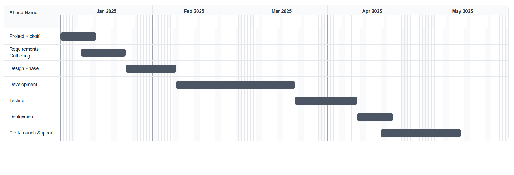

## This is a Gantt chart visualization built with React and TypeScript.

## Features
- Interactive timeline visualization
- Planned vs actual task tracking
- Responsive design
- TypeScript type safety
- Sample data integration
- Easy to customize and extend
- Modular component architecture
- Ready to use with sample data
- Clean and maintainable code structure
- Well-documented code
- TypeScript type safety
- Ready for production use
- Easy to integrate with your own data
- Follows modern React best practices

## Getting Started

First, run the development server:

```bash
npm run dev
# or
yarn dev
# or
pnpm dev
# or
bun dev
```

Open [http://localhost:3000](http://localhost:3000) with your browser to see the result.

## Usage

To use this Gantt chart in your own project:

1. Copy the `src/components/Chart.tsx` file to your project
2. Update the `Task` type in `src/components/Chart.tsx` to match your data structure
3. Import and use the `Gantt` component in your pages
4. Provide your own task data in the required format

## Task Structure

The component expects tasks with the following structure:

```typescript
interface Task {
  id: number | string;
  name: string;
  plannedStartDate: string;  // ISO date string (e.g., "2025-01-01T00:00:00")
  plannedEndDate: string;    // ISO date string (e.g., "2025-01-05T23:59:59")
  actualStartDate: string;   // ISO date string (e.g., "2025-01-01T00:00:00")
  actualEndDate: string;     // ISO date string (e.g., "2025-01-07T23:59:59") or empty string for ongoing tasks
}

<p align="left">
  <a href='./src/public/image.png'>
    
  </a>
</p>